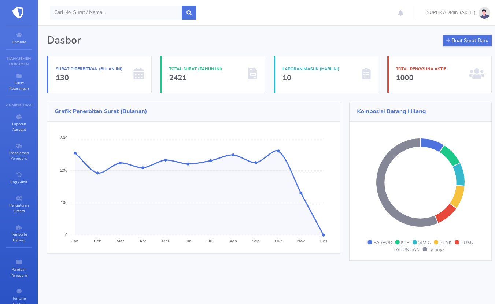
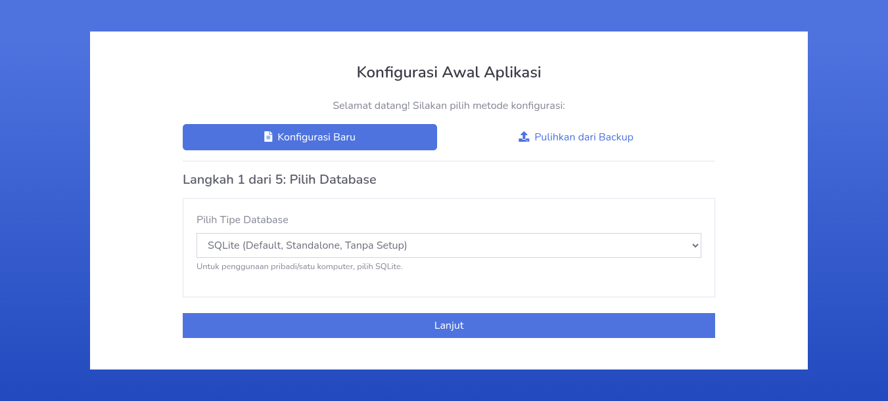
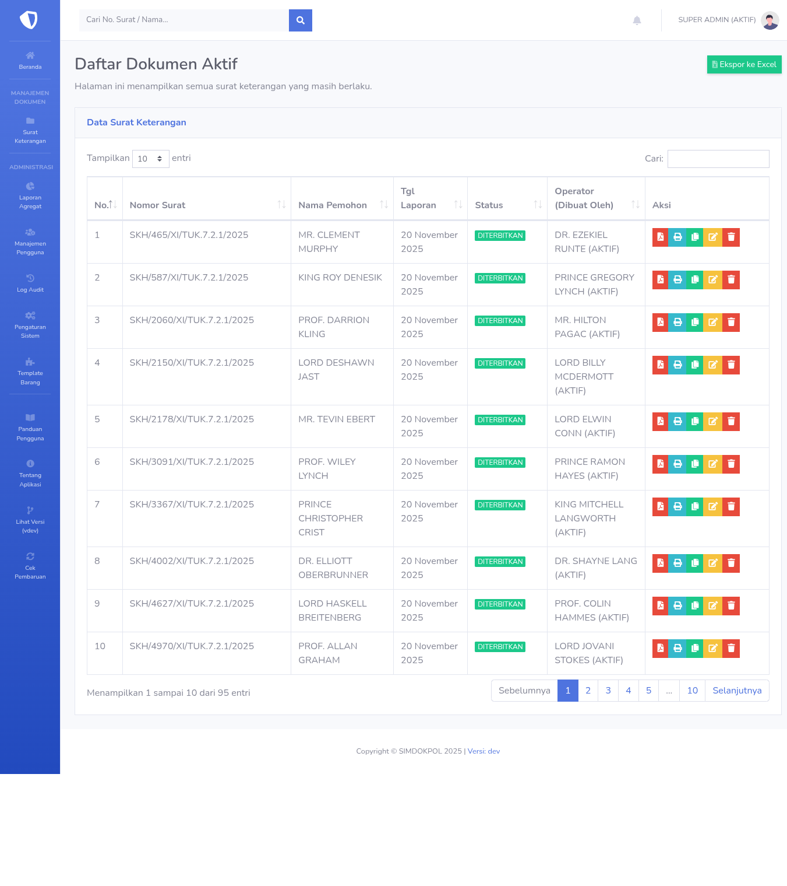
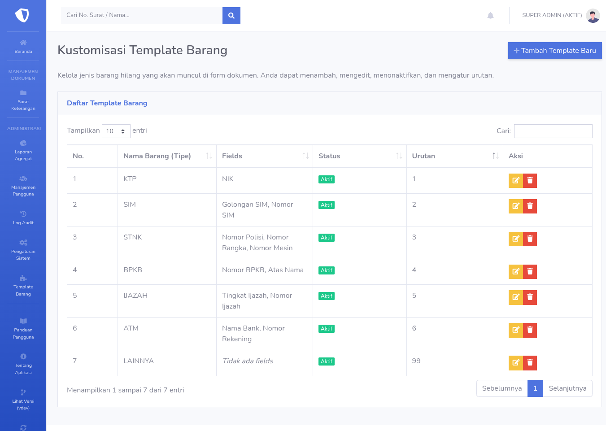
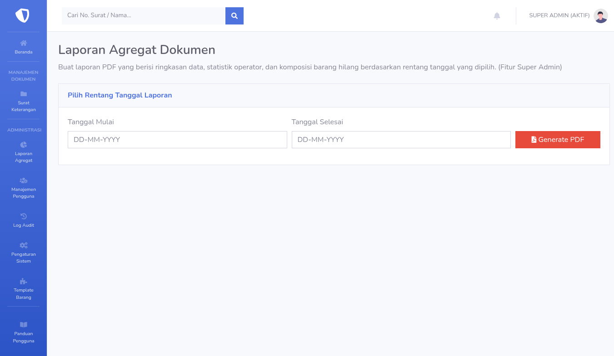
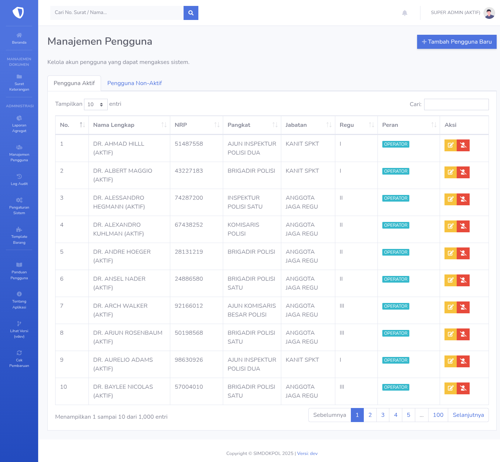

# 📋 Sistem Informasi Manajemen Dokumen Kepolisian (SIMDOKPOL)

<div align="center">


**Solusi Manajemen Dokumen Kepolisian yang Modern, Aman, dan Efisien**

[📥 Download](#memulai) • [📖 Dokumentasi](https://github.com/muhammad1505/simdokpol/wiki) • [🐛 Laporkan Bug](https://github.com/muhammad1505/simdokpol/issues) • [💬 Diskusi](https://github.com/muhammad1505/simdokpol/discussions)

</div>

---

## 🎯 Tentang SIMDOKPOL

SIMDOKPOL adalah aplikasi desktop cross-platform yang dirancang khusus untuk membantu unit kepolisian dalam mengelola dan menerbitkan surat keterangan secara efisien, cepat, dan aman. Aplikasi ini menggabungkan teknologi modern dengan antarmuka yang intuitif untuk memberikan pengalaman pengguna yang optimal.

Aplikasi ini menawarkan fleksibilitas deployment dengan dua mode operasi yang dapat disesuaikan dengan kebutuhan organisasi. Mode standalone menggunakan database SQLite yang portabel, cocok untuk penggunaan di satu komputer atau unit kerja kecil. Sementara mode client-server memanfaatkan database terpusat MySQL atau PostgreSQL untuk mendukung kolaborasi tim di jaringan kantor dengan sinkronisasi data real-time.

<div align="center">



*Dashboard analitik dengan visualisasi data real-time*

</div>

---

## ✨ Fitur Unggulan

### 🗄️ Dukungan Multi-Database
Aplikasi mendukung tiga jenis database yang dapat dipilih sesuai kebutuhan organisasi. SQLite menawarkan kemudahan deployment tanpa konfigurasi server, MySQL memberikan performa optimal untuk skala menengah, dan PostgreSQL menyediakan fitur enterprise-grade untuk kebutuhan yang lebih kompleks.

### 🎨 Setup Wizard Interaktif
Proses konfigurasi awal dipandu melalui wizard lima langkah yang intuitif, mencakup pemilihan database, testing koneksi untuk memastikan konfigurasi yang tepat, pengaturan kop surat organisasi, dan pembuatan akun administrator pertama dengan keamanan terjamin.

### 🖥️ Aplikasi Desktop Mandiri
Berjalan sebagai aplikasi desktop native dengan integrasi penuh ke sistem operasi. Fitur ini mencakup icon di system tray untuk akses cepat, notifikasi native untuk alert penting, dan kemampuan berjalan di background tanpa mengganggu produktivitas pengguna.

### 📝 Kustomisasi Template Dinamis *(Fitur Profesional)*
Editor visual dengan antarmuka drag-and-drop memungkinkan administrator menyesuaikan formulir barang hilang seperti KTP, SIM, dan BPKB sesuai kebijakan organisasi. Sistem field dinamis mendukung penambahan, pengurangan, dan pengaturan ulang elemen formulir tanpa memerlukan keahlian teknis.

### 📊 Pelaporan Agregat Komprehensif *(Fitur Profesional)*
Menghasilkan laporan PDF profesional yang berisi analisis statistik mendalam tentang aktivitas operator, distribusi jenis barang hilang, dan tren temporal berdasarkan rentang tanggal yang dapat disesuaikan. Laporan ini dirancang untuk mendukung kebutuhan manajemen dan compliance reporting.

### 🔄 Migrasi Data Streaming *(Fitur Profesional)*
Alat migrasi bawaan memfasilitasi perpindahan data yang aman dari SQLite ke MySQL atau PostgreSQL dengan progress monitoring real-time. Proses streaming memastikan integritas data terjaga dan meminimalkan downtime selama transisi infrastruktur.

### 🔐 Sistem Lisensi Terenkripsi
Implementasi freemium model dengan aktivasi fitur profesional melalui serial key yang diamankan menggunakan Hardware ID dan HMAC signature. Mekanisme ini mencegah penggunaan tidak sah dan memastikan setiap lisensi terikat pada perangkat spesifik.

### 📄 Generasi Dokumen Presisi Tinggi
Ekspor dokumen ke format PDF dengan kualitas cetak profesional menggunakan rendering server-side yang konsisten. Fitur profesional menyediakan ekspor tambahan ke format Excel untuk kebutuhan analisis data dan reporting yang lebih fleksibel.

### 👥 Manajemen Pengguna Berbasis Peran
Sistem Role-Based Access Control (RBAC) dengan dua tingkat hak akses yang terdefinisi dengan jelas. Super Admin memiliki kontrol penuh terhadap sistem termasuk konfigurasi dan manajemen pengguna, sementara Operator fokus pada operasional dokumen sehari-hari dengan pembatasan akses yang sesuai.

### 📝 Audit Trail Komprehensif
Setiap aktivitas penting dalam sistem dicatat secara otomatis dengan informasi lengkap tentang pengguna yang melakukan tindakan, jenis operasi yang dilakukan, timestamp yang akurat, dan detail perubahan data. Log audit dapat diekspor ke Excel untuk keperluan investigasi atau compliance audit.

### 💾 Backup & Restore Otomatis
Fungsi hot-backup untuk database SQLite memungkinkan pencadangan data tanpa menghentikan operasional sistem. Proses restore yang mudah dan cepat memastikan business continuity dalam situasi darurat atau disaster recovery.

### 🔒 Mode HTTPS Secure
Dukungan enkripsi SSL lokal dengan fitur auto-install certificate ke Windows Trusted Root Store. Implementasi ini memastikan komunikasi antara browser dan aplikasi terenkripsi penuh, melindungi data sensitif dari intersepsi jaringan.

### 🔄 Update Checker Otomatis
Sistem secara otomatis memeriksa ketersediaan versi terbaru dari GitHub releases dan memberikan notifikasi kepada administrator. Fitur ini memastikan organisasi selalu mendapatkan patch keamanan dan peningkatan fitur terkini.

---

## 📸 Galeri Antarmuka

<table width="100%">
    <tr>
        <td width="50%" align="center">
            
            <br><strong>🔧 Wizard Setup Multi-Database</strong>
            <br><em>Konfigurasi awal yang terpandu dengan testing koneksi real-time</em>
        </td>
        <td width="50%" align="center">
            
            <br><strong>📁 Manajemen Dokumen Aktif</strong>
            <br><em>Interface modern untuk pengelolaan surat keterangan yang efisien</em>
        </td>
    </tr>
    <tr>
        <td width="50%" align="center">
            
            <br><strong>⚙️ Panel Pengaturan Sistem</strong>
            <br><em>Konfigurasi terpusat untuk semua aspek aplikasi</em>
        </td>
        <td width="50%" align="center">
            
            <br><strong>🎨 Editor Template (Pro)</strong>
            <br><em>Kustomisasi formulir dengan drag-and-drop visual</em>
        </td>
    </tr>
    <tr>
        <td width="50%" align="center">
            
            <br><strong>📊 Pelaporan Agregat (Pro)</strong>
            <br><em>Analisis statistik komprehensif dalam format PDF profesional</em>
        </td>
        <td width="50%" align="center">
            
            <br><strong>👤 Dashboard Manajemen Pengguna</strong>
            <br><em>Kontrol akses dan monitoring aktivitas pengguna</em>
        </td>
    </tr>
</table>

---

## 🛠️ Arsitektur Teknologi

### Backend Infrastructure
Aplikasi dibangun menggunakan Go versi 1.23 atau lebih tinggi yang memberikan performa tinggi dan efisiensi memori. Framework web Gin menyediakan routing HTTP yang cepat dengan middleware support yang ekstensif. GORM sebagai Object-Relational Mapping layer memfasilitasi interaksi database yang aman dan type-safe, sementara golang-migrate mengelola versioning skema database dengan rollback capability.

### Database Support
Arsitektur multi-database mendukung SQLite untuk deployment ringan dan portabel, MySQL untuk skalabilitas tingkat menengah dengan replikasi support, dan PostgreSQL untuk fitur advanced seperti full-text search dan JSON operations. Setiap database dialect dioptimalkan untuk performa maksimal dengan query optimization yang spesifik.

### Frontend Technology
Antarmuka pengguna menggabungkan Go HTML templates untuk server-side rendering yang efisien dengan Metro-inspired CSS yang memberikan tampilan modern dan professional. JavaScript libraries termasuk jQuery untuk DOM manipulation yang efisien, Bootstrap untuk responsive layout yang konsisten di berbagai resolusi layar, dan Chart.js untuk visualisasi data interaktif yang informatif.

### Document Generation
Modul generasi dokumen menggunakan gofpdf library untuk menghasilkan PDF dengan presisi tinggi yang siap cetak, mendukung Unicode fonts untuk karakter Indonesia, dan layout yang konsisten. Excelize library memfasilitasi pembuatan spreadsheet Excel dengan formula support dan formatting yang kompleks untuk keperluan data export dan reporting.

### Desktop Integration
Integrasi sistem operasi memanfaatkan getlantern/systray untuk system tray icon dengan menu kontekstual yang native, dan gen2brain/beeep untuk notifikasi desktop yang mematuhi guidelines masing-masing platform. Implementasi ini memastikan aplikasi terasa seperti aplikasi native di setiap sistem operasi.

### Build & Distribution
Pipeline packaging menggunakan NSIS untuk Windows installer dengan custom branding dan registry integration, DEB package untuk Debian/Ubuntu dengan automatic dependency resolution, RPM package untuk RedHat/CentOS/Fedora dengan systemd integration, dan DMG bundle untuk macOS dengan code signing support.

---

## 🚀 Memulai

### 💿 Instalasi untuk Pengguna Akhir

Unduh installer terbaru yang sesuai dengan sistem operasi dari halaman [Releases](https://github.com/muhammad1505/simdokpol-release/releases) resmi kami.

**🪟 Windows**
Jalankan file installer dengan format `SIMDOKPOL-windows-x64-vX.X.X-installer.exe` menggunakan hak akses administrator. Wizard instalasi akan memandu proses setup termasuk pemilihan direktori instalasi dan pembuatan shortcut. Setelah instalasi selesai, aplikasi dapat diakses melalui Desktop shortcut atau Start Menu.

**🐧 Linux**
Instal paket sesuai distribusi menggunakan package manager. Untuk distribusi berbasis Debian atau Ubuntu gunakan `sudo dpkg -i simdokpol_X.X.X_amd64.deb` diikuti `sudo apt-get install -f` untuk menyelesaikan dependensi. Untuk distribusi berbasis RedHat gunakan `sudo rpm -i simdokpol-X.X.X-1.x86_64.rpm`. Aplikasi akan tersedia di application menu sistem.

**🍎 macOS**
Buka file DMG dan seret aplikasi SIMDOKPOL ke folder Applications. Pada peluncuran pertama, sistem mungkin meminta konfirmasi untuk membuka aplikasi dari developer yang tidak terverifikasi. Akses System Preferences > Security & Privacy dan klik "Open Anyway" untuk memberikan izin.

### 🎯 Konfigurasi Awal

Pada peluncuran pertama kali, aplikasi secara otomatis membuka browser default menuju halaman setup di `http://localhost:8080/setup`. Pengguna akan disajikan dua opsi konfigurasi yang dapat dipilih sesuai kebutuhan.

**Konfigurasi Baru**
Wizard lima langkah akan memandu proses setup lengkap yang mencakup pemilihan jenis database dengan testing koneksi untuk memverifikasi konfigurasi, pengaturan informasi kop surat organisasi termasuk nama instansi dan alamat, konfigurasi domain kustom jika diperlukan, dan pembuatan akun Super Admin pertama dengan password yang terenkripsi.

**Pemulihan dari Backup**
Khusus untuk database SQLite, pengguna dapat mengunggah file `simdokpol.db` dari instalasi sebelumnya untuk memulihkan semua data termasuk konfigurasi sistem, data pengguna, dan dokumen yang tersimpan. Proses ini memastikan transisi yang mulus saat melakukan migrasi atau reinstalasi.

### 🔒 Konfigurasi HTTPS (Opsional)

Untuk meningkatkan keamanan komunikasi, administrator dapat mengaktifkan mode HTTPS melalui menu Pengaturan Sistem. Setelah aktivasi, aplikasi akan meminta izin untuk menginstal sertifikat SSL self-signed ke Windows Trusted Root Certificate Store. Proses ini memerlukan elevasi hak administrator dan akan menghilangkan peringatan keamanan browser pada akses berikutnya.

### 👨‍💻 Setup untuk Pengembang

**Prasyarat Sistem**
Pengembangan memerlukan Go versi 1.23 atau lebih tinggi yang dapat diunduh dari golang.org, Git untuk version control dan collaboration, serta C compiler seperti TDM-GCC atau Mingw-w64 untuk Windows atau build-essential package untuk Linux yang diperlukan untuk kompilasi CGO dependencies dari SQLite.

**Instalasi & Eksekusi**

Kloning repository dan navigasi ke direktori proyek:
```bash
git clone https://github.com/muhammad1505/simdokpol.git
cd simdokpol
```

Instalasi seluruh dependensi menggunakan Go modules:
```bash
go mod tidy
```

Menjalankan aplikasi dalam mode development dengan hot-reload menggunakan Air (konfigurasi sudah tersedia di `.air.toml`):
```bash
air
```

Aplikasi akan berjalan di `http://localhost:8080` dengan automatic reload setiap kali terjadi perubahan kode.

**Build Produksi**

Untuk membuat binary produksi dengan optimasi penuh:
```bash
# Windows (GUI mode tanpa console window)
go build -ldflags "-s -w -H=windowsgui" -o simdokpol.exe cmd/main.go

# Linux/macOS
go build -ldflags "-s -w" -o simdokpol cmd/main.go
```

Flag `-s -w` menghapus debug symbols untuk mengurangi ukuran binary, sementara `-H=windowsgui` pada Windows menyembunyikan console window untuk pengalaman aplikasi desktop yang lebih baik.

---

## 📁 Struktur Proyek

```
simdokpol/
├── cmd/
│   ├── keygen/             # 🔑 Generator Key Pair ECDSA (Dev Tool)
│   ├── license-manager/    # 📜 GUI Manager Lisensi & Key (Dev Tool)
│   ├── seeder/             # 🌱 Seeder data dummy & migrator (Dev Tool)
│   ├── signer/             # ✍️ Generator Serial Key CLI (Dev Tool)
│   └── main.go             # 🚀 Entrypoint aplikasi utama
├── internal/
│   ├── config/             # ⚙️ Logic pemuatan config & .env
│   ├── controllers/        # 🎮 HTTP handlers (logic API)
│   ├── dto/                # 📦 Data Transfer Objects
│   ├── middleware/         # 🛡️ Auth, Admin, Setup, License middleware
│   ├── models/             # 🗃️ Model data GORM (entities)
│   ├── mocks/              # 🎭 Mock interface untuk unit test
│   ├── repositories/       # 💾 Data access layer (interaksi GORM)
│   ├── services/           # 🔧 Business logic (Lisensi, Update, PDF, Backup)
│   └── utils/              # 🛠️ Helper (PDF Generator, AppDir, HWID, Certs)
├── migrations/             # 📚 File migrasi skema database SQL
│   ├── mysql/              # 🐬 Migrasi khusus MySQL
│   ├── sqlite/             # 💿 Migrasi khusus SQLite
│   └── postgres/           # 🐘 Migrasi khusus PostgreSQL
├── web/
│   ├── static/             # 🎨 Aset statis (CSS, JS, Images)
│   ├── templates/          # 📄 Template HTML & Partials
│   └── assets.go           # 📦 Go Embed Configuration
├── .github/
│   ├── assets/             # 📸 Screenshot untuk dokumentasi
│   └── workflows/          # 🔄 CI/CD (Test & Release Build)
├── .air.toml               # 🔥 Konfigurasi live-reload Air
├── go.mod                  # 📋 Manajemen dependensi Go
└── README.md               # 📖 Dokumentasi proyek
```

### Penjelasan Arsitektur

Direktori `cmd` berfungsi sebagai collection dari entry points aplikasi, memisahkan aplikasi utama dari development tools seperti key generator dan license manager. Struktur ini memungkinkan build yang terpisah untuk setiap binary dengan dependensi yang minimal.

Paket `internal` mengimplementasikan business logic dengan pemisahan concern yang jelas. Controllers menangani HTTP request/response cycle, services mengenkapsulasi business rules yang kompleks, repositories menyediakan abstraksi untuk data access, dan middleware menangani cross-cutting concerns seperti authentication dan logging.

Direktori `migrations` menyimpan SQL migration files yang terorganisir berdasarkan database dialect. Setiap perubahan skema didokumentasikan dalam migration file dengan up dan down script untuk mendukung rollback yang aman.

Direktori `web` mengorganisir semua frontend assets dengan struktur yang memudahkan maintenance. Go embed directive memungkinkan semua aset di-bundle ke dalam single binary untuk distribusi yang lebih mudah tanpa dependensi eksternal.

---

## ⚙️ Manajemen Konfigurasi

Aplikasi mengimplementasikan best practice untuk penyimpanan konfigurasi dengan menempatkan file `.env` di direktori data pengguna sesuai konvensi masing-masing sistem operasi. Pendekatan ini memisahkan konfigurasi dari binary aplikasi, memudahkan backup, dan meningkatkan keamanan.

**Lokasi Konfigurasi Berdasarkan Platform**

Platform Windows menyimpan konfigurasi di `C:\Users\<USERNAME>\AppData\Roaming\SIMDOKPOL\.env`, mematuhi Windows Application Data guidelines. Platform Linux mengikuti XDG Base Directory specification dengan path `/home/<username>/.config/SIMDOKPOL/.env`. Platform macOS menggunakan konvensi Apple dengan path `/Users/<username>/Library/Application Support/SIMDOKPOL/.env`.

File `.env` dibuat secara otomatis selama proses setup pertama kali dengan permission yang tepat untuk mencegah akses tidak sah. Aplikasi melakukan validasi konfigurasi setiap kali startup untuk memastikan semua parameter yang diperlukan tersedia dan valid.

---

## 🛣️ Roadmap Pengembangan

### ✅ Fitur yang Telah Dirilis

**Infrastruktur Inti**
Arsitektur backend dan frontend yang bersih dengan separation of concerns yang jelas telah diimplementasikan mengikuti best practices Go programming. Dukungan multi-database production-ready untuk SQLite, MySQL, dan PostgreSQL dengan automated migration handling memastikan fleksibilitas deployment. Wizard setup lima langkah dengan database connection testing dan initial configuration memberikan onboarding experience yang smooth.

**Fitur Profesional**
Kustomisasi template barang dengan editor drag-and-drop visual memungkinkan administrator menyesuaikan formulir tanpa coding. Pembuatan laporan agregat PDF dengan analisis statistik komprehensif mendukung kebutuhan reporting manajemen. Alat migrasi data streaming antar database dengan progress monitoring real-time memfasilitasi transisi infrastruktur yang aman.

**Sistem Keamanan & Lisensi**
Implementasi sistem lisensi freemium dengan HMAC-secured hardware binding mencegah penggunaan tidak sah. Update checker otomatis via GitHub releases memastikan sistem selalu up-to-date dengan security patches terbaru. HTTPS secure mode dengan auto-install certificate ke system trust store melindungi komunikasi dari intersepsi.

**Manajemen Dokumen & Pengguna**
Alur kerja surat keterangan hilang dengan CRUD operations lengkap dan validation rules yang ketat. Autentikasi dan otorisasi berbasis peran dengan pembagian hak akses yang granular. Manajemen pengguna komprehensif dengan capabilities untuk create, update, activate, dan deactivate accounts.

**Analytics & Monitoring**
Dashboard analitik dengan grafik dinamis menggunakan Chart.js untuk visualisasi real-time. Modul audit log yang mencatat semua aktivitas penting dengan timestamp accuracy dan user attribution. Ekspor data ke Excel untuk dokumen dan audit trails mendukung compliance reporting.

**Operasional & Deployment**
Fitur backup dan restore untuk SQLite dengan hot-backup capability tanpa downtime. Aplikasi desktop standalone dengan system tray integration dan native notifications. Multi-platform installer untuk Windows (NSIS), Linux (DEB/RPM), dan macOS (DMG) dengan automated build pipeline. CI/CD workflow lengkap dengan unit tests, linter, dan integration tests untuk tiga database engines.

**Document Generation**
Generasi PDF presisi tinggi dengan server-side rendering yang konsisten. Template engine yang fleksibel dengan support untuk custom layouts dan branding. Export capability ke multiple formats termasuk PDF dan Excel untuk flexibility.

### 🔮 Rencana Pengembangan Mendatang

**API & Integrasi**
Pengembangan REST API publik dengan dokumentasi Swagger/OpenAPI akan memungkinkan integrasi dengan sistem eksternal seperti SISFO atau aplikasi mobile custom. API akan mencakup authentication via JWT tokens, rate limiting untuk mencegah abuse, dan comprehensive error handling dengan status codes yang informatif.

**Infrastructure Enhancement**
Implementasi server lisensi online dengan validation terpusat akan meningkatkan keamanan dan memberikan analytics tentang license usage patterns. Sistem ini akan mendukung license revocation real-time, automatic renewal notifications, dan usage tracking untuk compliance monitoring.

**Advanced Document Features**
Visual PDF editor dengan WYSIWYG interface akan memungkinkan administrator memodifikasi layout dokumen secara graphical tanpa memerlukan pemahaman tentang PDF internals. Feature ini akan include drag-and-drop positioning untuk text dan image elements, real-time preview, dan template versioning.

**Communication & Notifications**
Integrasi notifikasi email akan mengirimkan automated alerts untuk certificate expiry warnings, system events yang critical, dan daily activity summaries. Sistem akan support SMTP configuration dengan TLS encryption dan template customization untuk branding consistency.

---

## 🔧 Panduan Troubleshooting

### 🔒 Peringatan Keamanan HTTPS

**Deskripsi Masalah**
Browser menampilkan warning "Your connection is not private" atau "NET::ERR_CERT_AUTHORITY_INVALID" saat mengakses aplikasi melalui HTTPS, meskipun koneksi sebenarnya aman.

**Solusi Komprehensif**
Navigasikan ke menu Pengaturan Sistem melalui sidebar aplikasi dan buka tab Umum. Locate toggle switch untuk "Aktifkan Mode HTTPS" dan matikan terlebih dahulu jika sudah aktif. Tunggu beberapa detik lalu aktifkan kembali untuk trigger certificate regeneration. Sistem akan menampilkan popup konfirmasi yang meminta izin untuk menginstal sertifikat SSL ke Windows Trusted Root Certificate Store. Klik tombol "Ya" atau "Install" dan approve User Account Control prompt yang muncul. Setelah instalasi berhasil, restart browser dan akses kembali aplikasi. Warning security seharusnya sudah tidak muncul lagi.

### 💾 Error Write Permission Database di Windows

**Deskripsi Masalah**
Aplikasi menampilkan error "attempt to write a readonly database" atau gagal menyimpan perubahan data, terutama setelah instalasi baru atau setelah copy-paste folder aplikasi.

**Analisis Penyebab**
Error ini terjadi karena aplikasi tidak memiliki write permission ke direktori database, biasanya disebabkan oleh file yang dijalankan langsung dari dalam compressed archive (ZIP) atau folder yang di-protect oleh Windows.

**Langkah Penyelesaian**
Pastikan file installer atau portable archive sudah diekstrak lengkap ke folder permanen di hard drive, bukan dijalankan dari temporary folder atau dari dalam ZIP file. Jika masalah persists, klik kanan pada shortcut aplikasi dan pilih "Run as administrator" untuk memberikan elevated permissions. Untuk solusi permanent, navigate ke folder instalasi aplikasi (biasanya di `C:\Program Files\SIMDOKPOL`), klik kanan folder tersebut, pilih Properties > Security tab, dan ensure bahwa user account memiliki "Full Control" permission. Aplikasi juga memerlukan write access ke folder `%APPDATA%\SIMDOKPOL` di mana database dan konfigurasi disimpan.

### 🔔 Icon System Tray Tidak Muncul

**Deskripsi Masalah**
Setelah aplikasi dijalankan, icon tidak muncul di system tray atau notification area, sehingga akses cepat ke aplikasi tidak tersedia.

**Diagnosis Platform-Specific**
Untuk Windows, verify bahwa icon file `icon.png` ter-embed dengan benar dalam binary dengan check file size. Binary dengan embedded assets seharusnya berukuran lebih besar dari versi tanpa assets. Untuk Linux, masalah ini commonly disebabkan oleh missing system tray implementation di desktop environment. Install package `libayatana-appindicator3-1` untuk Ubuntu/Debian dengan command `sudo apt-get install libayatana-appindicator3-1`, atau equivalent package untuk distribusi lain. Untuk macOS, ensure aplikasi memiliki permission untuk menampilkan notifications melalui System Preferences > Notifications.

**Solusi Umum**
Jika rebuild dari source code, pastikan directive Go embed di file `web/assets.go` sudah benar dan direktori `web/static/img/` beserta isinya ada sebelum kompilasi. Untuk binary yang sudah jadi, coba restart sistem operasi untuk refresh system tray subsystem. Sebagai workaround sementara, aplikasi tetap dapat diakses melalui browser dengan membuka `http://localhost:8080` secara manual.

### 🌐 Tidak Bisa Mengakses dari Komputer Lain di Jaringan

**Deskripsi Masalah**
Aplikasi berjalan normal di komputer server tetapi tidak dapat diakses dari komputer client lain di jaringan lokal.

**Troubleshooting Sistematis**
Verify bahwa aplikasi di-bind ke network interface yang benar dengan check konfigurasi `SERVER_HOST` di file `.env`. Untuk access dari jaringan, set value menjadi `0.0.0.0` instead of `localhost` atau `127.0.0.1`. Check Windows Firewall atau firewall sistem lain untuk memastikan port aplikasi (default 8080) tidak di-block. Buat inbound rule baru di Windows Firewall untuk allow connections pada port tersebut. Test koneksi dari komputer client menggunakan command `telnet <ip-server> 8080` untuk verify network connectivity. Pastikan semua komputer di jaringan yang sama dengan check IP address range. Jika menggunakan HTTPS mode, install sertifikat SSL ke setiap client computer agar tidak mendapat certificate warning.

### 📊 Error Saat Generate Laporan PDF

**Deskripsi Masalah**
Proses generate laporan agregat gagal dengan error message atau menghasilkan PDF yang corrupt atau blank.

**Identifikasi Penyebab**
Error biasanya disebabkan oleh missing font files untuk support Unicode characters, insufficient disk space di temporary directory, atau data yang terlalu besar untuk di-render dalam single PDF page.

**Resolusi Langkah-demi-Langkah**
Ensure bahwa folder `web/static/fonts/` berisi font files yang diperlukan dan ter-embed dengan benar dalam binary. Check available disk space di sistem dengan minimal 100MB free space untuk temporary PDF processing. Jika generate laporan untuk date range yang sangat luas, coba pecah menjadi beberapa periode yang lebih kecil. Review application logs di folder `%APPDATA%\SIMDOKPOL\logs\` untuk error messages yang lebih spesifik. Jika error persists, try regenerate laporan di luar peak hours saat server load lebih rendah.

Untuk pertanyaan teknis lain atau issues yang tidak tercakup dalam guide ini, silakan buat detailed issue report di halaman GitHub Issues dengan menyertakan informasi sistem operasi dan versi, versi aplikasi yang digunakan, langkah-langkah reproduksi yang jelas, screenshot atau log files yang relevan, dan expected vs actual behavior untuk membantu tim development provide solution yang tepat dan cepat.

---

## 📜 Lisensi

Proyek ini dilisensikan di bawah ketentuan MIT License yang memberikan kebebasan untuk menggunakan, memodifikasi, dan mendistribusikan software ini dengan minimal restrictions. Lisensi MIT dipilih untuk mendorong kolaborasi open-source dan memungkinkan organisasi kepolisian untuk mengadaptasi software sesuai kebutuhan spesifik mereka tanpa hambatan legal yang kompleks.

Untuk membaca teks lengkap lisensi termasuk disclaimer of warranty dan limitation of liability, silakan rujuk ke file [LICENSE](https://github.com/muhammad1505/simdokpol/blob/main/LICENSE) yang tersedia di repository root. Dengan menggunakan software ini, pengguna dianggap telah membaca dan menyetujui seluruh terms and conditions yang tercantum dalam lisensi.

---

## 👥 Tim Pengembangan

**Lead Developer:** Muhammad Yusuf Abdurrohman

Proyek SIMDOKPOL dikembangkan dengan dedikasi penuh untuk memberikan solusi terbaik bagi unit kepolisian Indonesia dalam mengelola dokumen administratif. Kami percaya bahwa teknologi harus mempermudah pekerjaan, bukan memperumitnya, dan filosofi ini tercermin dalam setiap aspek desain dan implementasi aplikasi.

Kami menyambut kontribusi dari komunitas developer dan praktisi kepolisian untuk terus meningkatkan kualitas aplikasi. Kontribusi dapat berupa pelaporan bug yang ditemukan, saran fitur baru yang dibutuhkan, perbaikan dokumentasi untuk kejelasan, atau pull request untuk implementasi fitur. Setiap kontribusi akan direview dengan teliti dan diapresiasi sebagai bagian dari upaya kolektif untuk meningkatkan efisiensi layanan kepolisian.

Untuk melihat daftar lengkap kontributor yang telah berpartisipasi dalam pengembangan proyek ini, silakan kunjungi halaman [Contributors](https://github.com/muhammad1505/simdokpol/graphs/contributors) di repository GitHub kami. Kami berterima kasih kepada setiap individu yang telah meluangkan waktu dan keahliannya untuk membuat SIMDOKPOL menjadi lebih baik.

---

## 📞 Dukungan dan Kontak

Tim pengembangan berkomitmen untuk memberikan dukungan berkualitas tinggi kepada seluruh pengguna SIMDOKPOL. Kami memahami bahwa aplikasi ini menangani dokumen penting dan operasional yang tidak boleh terganggu, sehingga responsivitas dan kualitas dukungan menjadi prioritas utama kami.

### 🐛 Dukungan Teknis Resmi

Untuk masalah teknis dan bug report yang memerlukan investigasi mendalam, kami menyediakan GitHub Issues tracker sebagai platform resmi pelaporan. Saat membuat issue baru, pengguna diminta untuk menyertakan informasi sistem yang lengkap termasuk versi aplikasi, sistem operasi, dan konfigurasi database yang digunakan. Langkah-langkah reproduksi yang detail akan sangat membantu tim development dalam mengidentifikasi dan memperbaiki masalah dengan cepat. Screenshot atau log files yang relevan dapat dilampirkan untuk memperjelas konteks masalah.

Untuk diskusi umum yang bersifat non-teknis seperti best practices dalam penggunaan aplikasi, permintaan fitur baru yang ingin didiskusikan dengan komunitas, berbagi tips dan trik optimasi, atau pertanyaan implementasi di lingkungan spesifik, platform GitHub Discussions menyediakan forum yang tepat. Komunitas pengguna SIMDOKPOL yang semakin berkembang sering kali dapat memberikan insight berharga berdasarkan pengalaman mereka sendiri.

### 💬 Saluran Komunikasi Langsung

Untuk keperluan konsultasi, pertanyaan mendesak, atau komunikasi bisnis, kami menyediakan berbagai saluran kontak langsung yang dapat disesuaikan dengan preferensi dan kebutuhan pengguna.

**📧 Email Resmi:** emailbaruku50@gmail.com

Email merupakan saluran yang ideal untuk pertanyaan bisnis yang bersifat formal seperti proposal kerjasama atau partnership, konsultasi mendalam mengenai implementasi sistem di skala besar, permintaan quotation untuk lisensi profesional enterprise, atau diskusi kebutuhan kustomisasi khusus yang memerlukan development tambahan. Tim kami akan merespons email dalam waktu maksimal satu hari kerja dengan jawaban yang komprehensif dan profesional.

**💬 WhatsApp Business:** +62 823-0001-4685

WhatsApp Business kami beroperasi untuk memberikan dukungan real-time dan konsultasi cepat selama jam kerja Indonesia yaitu Senin hingga Jumat pukul 08:00 sampai 17:00 WIB. Saluran ini cocok untuk pertanyaan teknis yang memerlukan respons cepat, troubleshooting guided step-by-step, diskusi implementasi yang membutuhkan komunikasi interaktif, atau follow-up dari komunikasi sebelumnya yang memerlukan klarifikasi tambahan. Kami berkomitmen untuk merespons pesan dalam waktu maksimal dua jam selama jam operasional.

**📱 Telegram:** @simdokpol_support

Telegram channel kami menyediakan alternatif komunikasi instant yang dapat diakses dari berbagai platform dan devices. Channel ini aktif untuk diskusi teknis yang memerlukan sharing code snippets atau logs, update informasi produk terbaru termasuk release notes, pengumuman maintenance atau downtime yang terencana, dan tips penggunaan fitur-fitur advanced. Pengguna juga dapat bergabung dalam group Telegram komunitas SIMDOKPOL untuk berinteraksi dengan pengguna lain dan berbagi pengalaman.

**👥 Facebook Page:** [SIMDOKPOL Official](https://facebook.com/simdokpol)

Halaman Facebook resmi kami berfungsi sebagai hub untuk konten edukasi dan informasi produk. Pengguna dapat mengikuti halaman untuk mendapatkan update fitur baru dan improvement, tutorial video penggunaan aplikasi, case studies dari implementasi di berbagai unit kepolisian, pengumuman event seperti webinar atau training, dan artikel tips optimasi workflow. Platform ini juga memungkinkan interaksi sosial dengan komunitas pengguna SIMDOKPOL yang lebih luas.

### ⏱️ Service Level Agreement

Kami menerapkan standar respons time yang jelas untuk memastikan setiap pertanyaan mendapat perhatian yang layak. Untuk pertanyaan umum via email atau social media, target respons kami adalah maksimal satu hari kerja atau 24 jam. Untuk masalah teknis yang bersifat urgent dan mempengaruhi operasional, respons prioritas diberikan dalam waktu maksimal dua jam melalui WhatsApp atau Telegram selama jam kerja.

Untuk masalah yang dikategorikan sebagai critical dan memerlukan penanganan segera karena mengakibatkan downtime sistem atau data loss potential, pengguna diminta untuk menghubungi melalui WhatsApp atau Telegram dengan mencantumkan label "URGENT" atau "CRITICAL" di awal pesan. Tim on-call kami akan segera menangani dan memberikan emergency support untuk meminimalkan dampak terhadap operasional.

### 🎓 Sumber Daya Pembelajaran

Selain dukungan langsung, kami juga menyediakan berbagai sumber daya pembelajaran yang dapat diakses secara mandiri untuk memaksimalkan penggunaan aplikasi.

Dokumentasi lengkap tersedia di [Wiki GitHub](https://github.com/muhammad1505/simdokpol/wiki) yang mencakup panduan instalasi step-by-step untuk setiap platform, penjelasan fitur komprehensif dengan screenshot ilustratif, best practices untuk keamanan dan backup, troubleshooting guide untuk masalah umum, dan API documentation untuk developer yang ingin melakukan integrasi.

Video tutorial yang demonstratif dapat ditemukan di channel YouTube kami yang memuat walkthrough setup awal, tutorial penggunaan fitur-fitur utama, tips dan trik produktivitas, dan session recording dari webinar yang pernah dilaksanakan.

Knowledge base kami yang terus diperbarui menyediakan FAQ untuk pertanyaan yang sering diajukan, common issues dengan solusi yang telah terverifikasi, release notes detail untuk setiap versi, dan migration guides untuk upgrade antar versi mayor.

---

## 🎯 Kata Penutup

SIMDOKPOL dikembangkan dengan visi untuk mentransformasi cara unit kepolisian mengelola dokumen administratif melalui pemanfaatan teknologi modern yang reliable, secure, dan user-friendly. Kami memahami bahwa setiap surat keterangan yang diterbitkan memiliki nilai penting bagi masyarakat yang memerlukannya, dan oleh karena itu kami berkomitmen untuk menyediakan sistem yang tidak hanya efisien tetapi juga menjaga integritas dan keamanan data dengan standar tertinggi.

Aplikasi ini merupakan hasil dari riset mendalam tentang workflow operasional kepolisian, feedback intensif dari praktisi di lapangan, dan implementasi best practices dalam software engineering. Setiap fitur dirancang dengan mempertimbangkan kebutuhan nyata pengguna, bukan sekedar menambahkan kompleksitas yang tidak perlu. Pendekatan user-centric ini memastikan bahwa SIMDOKPOL dapat diadopsi dengan mudah oleh personel dengan berbagai tingkat keahlian teknologi.

Kami percaya bahwa teknologi harus menjadi enabler yang memberdayakan petugas untuk fokus pada tugas-tugas yang lebih substantif, bukan terjebak dalam administrasi manual yang repetitif dan rawan kesalahan. Dengan otomasi proses dokumentasi, validasi data yang real-time, dan audit trail yang komprehensif, SIMDOKPOL membebaskan waktu berharga yang dapat dialokasikan untuk pelayanan masyarakat yang lebih berkualitas.

Perjalanan pengembangan SIMDOKPOL tidak berhenti di versi saat ini. Roadmap kami yang ambisius mencerminkan komitmen jangka panjang untuk terus berinovasi dan beradaptasi dengan kebutuhan yang berkembang. Feedback dari pengguna menjadi compass yang mengarahkan prioritas pengembangan, dan kami aktif mendengarkan serta merespons masukan konstruktif dari komunitas.

Bagi organisasi kepolisian yang sedang mempertimbangkan digitalisasi workflow dokumen mereka, kami siap memberikan konsultasi menyeluruh untuk memastikan implementasi yang sukses. Tim kami berpengalaman dalam change management dan dapat membantu merancang strategi transisi yang meminimalkan disruption terhadap operasional yang sedang berjalan.

Terima kasih kepada seluruh pengguna yang telah mempercayai SIMDOKPOL sebagai solusi manajemen dokumen mereka. Kepercayaan dan feedback Anda adalah motivasi terbesar bagi kami untuk terus meningkatkan kualitas dan kapabilitas aplikasi. Mari bersama-sama membangun sistem pelayanan kepolisian yang lebih efisien, transparan, dan akuntabel untuk Indonesia yang lebih baik.

---

<div align="center">

**Dikembangkan dengan dedikasi untuk Unit Kepolisian Indonesia**

[🌐 Website](https://github.com/muhammad1505/simdokpol) • [📖 Dokumentasi](https://github.com/muhammad1505/simdokpol/wiki) • [📥 Releases](https://github.com/muhammad1505/simdokpol/releases) • [📋 Changelog](https://github.com/muhammad1505/simdokpol/blob/main/CHANGELOG.md)

---

**SIMDOKPOL v1.0** - Solusi Modern untuk Manajemen Dokumen Kepolisian

*Efisien • Aman • Terpercaya*

Copyright © 2024 Muhammad Yusuf Abdurrohman. All rights reserved.

</div>